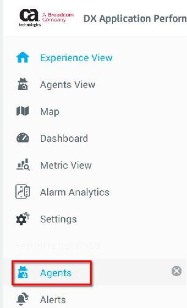
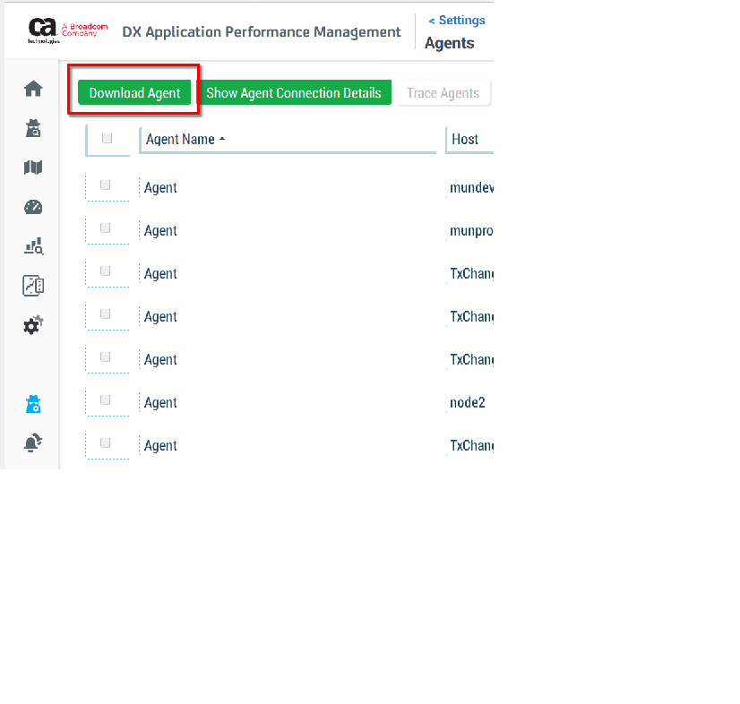
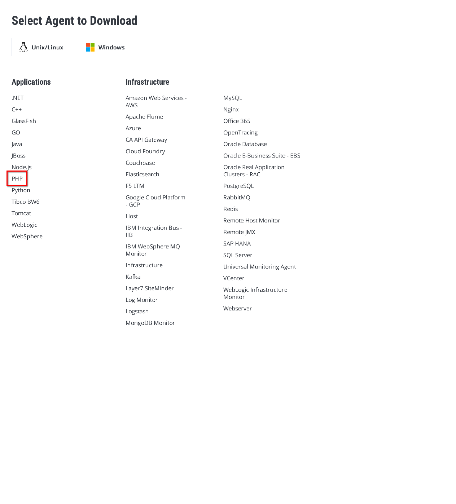
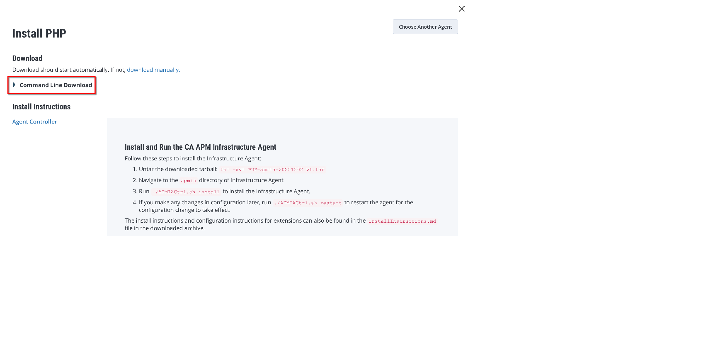
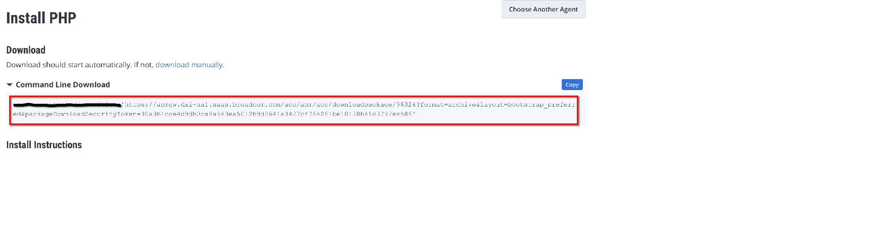

# php_probe_implant 1.0-1 by J. Mertin -- joerg.mertin@broadcom.com
Purpose: Implants the php-probe to report to a APMIA Agent

# Description
## Image description

This image build kit creates an image containing the **PHP remote
agent probe** to be implanted into a PHP application container at
start-time. The **implant** does not require the PHP application image
to be modified upfront. The Entrypoint subjugation method is being used.

## Implant the probe - docker compose method

Note, to implant the probe, the image first needs to be built. Please see the next section for details.
The following explanation will base itself on the below docker-compose.yml snippet.   
```
services:
  # Existing application
  app-rh-prod:
    image: calypso/pcm_rh:prod
    container_name: app-rh-prod
    entrypoint: /opt/apmia/run.sh
    depends_on:
      - php-probe-vol
    environment:
      - PHP_DEPLOY=true
      - PHP_APPNAME=pcm
      - PHP_AGENT_DISPLAYED_HOSTNAME=calypso
      - PHP_LOGDIR=/var/log
      - PHP_IAHOST=apmia-php-vol
      - PHP_IAPORT=5005
      - ENTRYPOINT=/run.sh
    volumes_from:
      - php-probe-vol:rw

  # Volume providing the PHP Probe to be implanted
  php-probe-vol:
    image: bcp/php_probe_implant:20.9.0.18
    container_name: php-probe-vol
    volumes:
      - /opt/apmia
```

A short explanation on the sections to be added.   

### php-probe-vol   
In your service definitions section, create an entry for the **php-probe-vol**.
it will hold all files required to implant the php probe into the existing PHP installation during container/pod creation.   
This volume that was built by you should have the exact same version number as your APMIA agent it will connect to!   

### app-rh-prod   
in this example, we assume the application we want to implant the *PHP Probe* into is the app-rh-prod and already running.
Add the following sections:   
``` 
entrypoint: /opt/apmia/run.sh
```
The **/opt/apmia/run.sh** is the entrypoint we will use. This script will implant the PHP Probe code into the running PHP environment, then execute the existing ENTRYPOINT Provided in the **environment** section.

The **depends_on** section will make sure that as long as the
php-prob-vol is not deployed, the application will not be executed.
```
    depends_on:
      - php-probe-vol
```

The Environment will provide various configuration options.   
Make sure to set PHP_DEPLOY=true, or else the script will act as if it was not called.   
Very important is th
```
    environment:
      - PHP_DEPLOY=true
      - PHP_APPNAME=pcm
      - PHP_AGENT_DISPLAYED_HOSTNAME=calypso
      - PHP_LOGDIR=/var/log
      - PHP_IAHOST=apmia-php-vol
      - PHP_IAPORT=5005
      - ENTRYPOINT=/run.sh
```

The following options can be added/set. By default, one should only
set PHP_APPNAME, PHP_AGENT_DISPLAYED_HOSTNAME and PHP_IAHOST. The
installer is pretty smart at detecting the rest automatically

- PHP_APPNAME: Sets the name of the Frontend application under which
  metrics will be reported. It is highly recommended to set an
  application name. Default value is "PHP_App"

- PHP_AGENT_DISPLAYED_HOSTNAME: Sets custom agent hostname for PHP
  Probe agent

- PHP_IAHOST [Mandatory]: Hostname/IP address of remote machine on
which Infrastructure agent is running and listening for Probe agents.   
If Infrastructure agent is running on the same machine as Probe agent
this param can be ignored. Defaults to localhost if not set

- PHP_IAPORT [Mandatory]: Port on which Infrastructure agent is
  listening for Probe agents (defaults to 5005 if not set)

- PHP_ROOT: PHP root directory
- PHP_EXT: PHP modules directory
- PHP_INI: PHP ini directory

- PHP_LOGDIR: PHP probe agent logs directory. WARNING: As this is a
  shared VOLUME, do not set the log directory to be in it!

- PHP_DEPLOY[Mandatory] [true:false]: Trigger to install the **PHP
  Remote Agent Probe**.

- PHP_PROBE_DIR: Directory the probe files exists. Defaults to
  /opt/apmia

- ENTRYPOINT [Mandatory]: This points to the original entrypoint defined in the application image at build time. Identify it using the docker describe call with:   
```
$ docker inspect 900c9593e313 | grep ENTRYPOINT
                "ENTRYPOINT ["/run.sh"]"
```   
or by checking inside the running pod which script/executable has PID 1.
```
# ps auxw
USER         PID %CPU %MEM    VSZ   RSS TTY      STAT START   TIME COMMAND
root           1  0.0  0.0   4624   808 ?        Ss   14:16   0:00 bin/bash ./APMIACtrl.sh force_start
```

Once all is configured, when launched with "docker-compose up -d" one
can see in the logs how the implant process was executed.
```
$ docker-compose logs pcm-rh-prod
Attaching to pcm-rh-prod
pcm-rh-prod        |  * Implanting PHP probe
pcm-rh-prod        | 
pcm-rh-prod        |  * Calling php-probe installer with the following options:
pcm-rh-prod        |  => -appname "pcm" -agenthostname "calypso" -iahost "apmia-php-vol"     -logdir /var/log
pcm-rh-prod        | 
pcm-rh-prod        | 
pcm-rh-prod        |   Installing CA APM PHP Probe Agent...
pcm-rh-prod        | 
pcm-rh-prod        |   Looking for PHP Installations on this machine...
pcm-rh-prod        | 
pcm-rh-prod        |   Installer found following PHP installations on this machine
pcm-rh-prod        | 
pcm-rh-prod        |    1) /usr/bin
pcm-rh-prod        |    2) /bin
pcm-rh-prod        | 
pcm-rh-prod        |   Installing CA APM PHP Probe Agent at all discovered PHP installation(s)...
pcm-rh-prod        | 
pcm-rh-prod        | 
pcm-rh-prod        | 
pcm-rh-prod        |   Installation Overview:
pcm-rh-prod        | 
pcm-rh-prod        | 1) PHP Root : /usr/bin/php
pcm-rh-prod        |    PHP Version : 7.2.34
pcm-rh-prod        |    PHP Extensions directory : /usr/lib64/php/modules
pcm-rh-prod        |    PHP Zend Thread Safety : Disabled
pcm-rh-prod        |    PHP ini directory : /etc/php.d
pcm-rh-prod        |    Installation Status : Success
pcm-rh-prod        | 
pcm-rh-prod        | 
pcm-rh-prod        | 2) PHP Root : /bin/php
pcm-rh-prod        |    PHP Version : 7.2.34
pcm-rh-prod        |    PHP Extensions directory : /usr/lib64/php/modules
pcm-rh-prod        |    PHP Zend Thread Safety : Disabled
pcm-rh-prod        |    PHP ini directory : /etc/php.d
pcm-rh-prod        |    Installation Status : Success
pcm-rh-prod        | 
pcm-rh-prod        | 
pcm-rh-prod        |    CA APM PHP Probe Agent is successfully installed on your machine.   
pcm-rh-prod        |    
pcm-rh-prod        |    1) To modify default CA APM PHP Probe agent settings update file at PHP INI directory   
pcm-rh-prod        |    2) Restart your web server or your PHP-FPM process to see performance metrics.
pcm-rh-prod        |      
pcm-rh-prod        |  * Handing over to real ENTRYPOINT: /run.sh
```


## Image creation

Due to legal restrictions, the probe itself cannot be distributed through a docker image.
However, anyone having access to a DX APM SaaS environment can build one himself.
Launch once the **build_image.sh** script. it will create a configuration file template you will need to enter the 

```
$ ./build_image.sh 

*** ERROR: Missing build_image.cfg configuration file (normal on first run)!
=============================================================================================================
# Go to the Agent Download Section, select to download the PHP Agent and open the "Command line Download".
# and put it all in the below link - incl. the security Token. Exclude the wget command!
PHP_FILE='<Insert here the download CLI URL for the PHP APMIA Agent>'
```   
   
In your DX APM SaaS environment, get the CLI Download URL for the PHP APMIA Agent (see section below with images).
Enter the link into the PHP_FILE= line, and execute the the build_image.sh script again.

```
$ ./build_image.sh 

>>> Download latest PHP Agent archive [y/n]?: y
--2020-12-02 15:55:00--  https://apmgw.dxi-na1.saas.broadcom.com/acc/apm/acc/downloadpackage/96322?format=archive&layout=bootstrap_preferred&packageDownloadSecurityToken=POisldkfmpsdjf[asjfnpuiHuhbgnibedfjs;dlfkspdfjanrngoirng
Resolving apmgw.dxi-na1.saas.broadcom.com (apmgw.dxi-na1.saas.broadcom.com)... 35.186.161.12
Connecting to apmgw.dxi-na1.saas.broadcom.com (apmgw.dxi-na1.saas.broadcom.com)|35.186.161.12|:443... connected.
HTTP request sent, awaiting response... 200 
Length: unspecified [application/x-tar]
Saving to: ‘PHP-apmia-20201202_v1.tar’

PHP-apmia-20201202_v1.tar                                 [                                             <=>                                                                          ] 169,36M  13,3MB/s    in 9,9s    

2020-12-02 15:55:12 (17,1 MB/s) - ‘PHP-apmia-20201202_v1.tar’ saved [177588736]

>>> Found PHP Monitor 20.9.0.18!

>>> Build PHP probe volume image [y/n]?: y

*** If you want to apply OS Update, don't use the cache.
>>> Use cache for build [y/n]?: y
Sending build context to Docker daemon  205.3MB
Step 1/10 : FROM alpine:3.10
 ---> be4e4bea2c2e
Step 2/10 : ARG PHP_EXTENSION_VER
 ---> Using cache
 ---> 8a5f024349a0
Step 3/10 : ARG PHP_EXTENSION_FILE
 ---> Using cache
 ---> 56f814e3cf8f
Step 4/10 : RUN mkdir -p /opt/apmia
 ---> Using cache
 ---> 065b30b6abb4
Step 5/10 : COPY $PHP_EXTENSION_FILE /opt/${PHP_EXTENSION_FILE}.bin
 ---> c07056ca42aa
Step 6/10 : ADD php-probe.sh /opt/apmia/php-probe.sh
 ---> 26d8a1fe2283
Step 7/10 : ADD run.sh /opt/apmia/run.sh
 ---> a320d1efcfb5
Step 8/10 : RUN apk update && apk add bash nano && tar xf /opt/${PHP_EXTENSION_FILE}.bin -C /opt && rm -f /opt/${PHP_EXTENSION_FILE}.bin
 ---> Running in 67922132adcc
fetch http://dl-cdn.alpinelinux.org/alpine/v3.10/main/x86_64/APKINDEX.tar.gz
fetch http://dl-cdn.alpinelinux.org/alpine/v3.10/community/x86_64/APKINDEX.tar.gz
v3.10.5-149-g803c562e66 [http://dl-cdn.alpinelinux.org/alpine/v3.10/main]
v3.10.5-141-g8ae988abb8 [http://dl-cdn.alpinelinux.org/alpine/v3.10/community]
OK: 10348 distinct packages available
(1/6) Installing ncurses-terminfo-base (6.1_p20190518-r2)
(2/6) Installing ncurses-libs (6.1_p20190518-r2)
(3/6) Installing readline (8.0.0-r0)
(4/6) Installing bash (5.0.0-r0)
Executing bash-5.0.0-r0.post-install
(5/6) Installing libmagic (5.37-r1)
(6/6) Installing nano (4.3-r0)
Executing busybox-1.30.1-r3.trigger
OK: 13 MiB in 20 packages
Removing intermediate container 67922132adcc
 ---> 1bc3548a355a
Step 9/10 : RUN chmod g+w -R /opt/apmia && chmod 555 /opt/apmia/run.sh /opt/apmia/php-probe.sh
 ---> Running in 178a1911a48f
Removing intermediate container 178a1911a48f
 ---> 9c79052b9afc
Step 10/10 : CMD /opt/apmia/run.sh
 ---> Running in bbb2f4d6394d
Removing intermediate container bbb2f4d6394d
 ---> d2900f7795dc
Successfully built d2900f7795dc
Successfully tagged calypso/php_probe_implant:latest
*** Tagging image to calypso/php_probe_implant:20.9.0.18
```
The image will automatically tagged with the version of the probe.
```
$ docker images | grep "calypso/php_probe_implant"
calypso/php_probe_implant                       20.9.0.18                  d2900f7795dc        About a minute ago   63.6MB
calypso/php_probe_implant                       latest                     d2900f7795dc        About a minute ago   63.6MB
```


### Finding the APMIA PHP Image

Log in into your DX APM SaaS environment and go into the **Agents** section.   

   
In the Agents section, select the **Download Agent** tab.   
   
   
Find and select the **PHP** Agent to be downloaded.


Make sure to select the **Command Line Download** on the top left
   
   
Finally, check the Command line download content, and select only the URL to download the PHP APMIA Package.   


This URL

# Manual Changelog
```
Wed,  2 Dec 2020 12:52:44
	- Initial release
```
